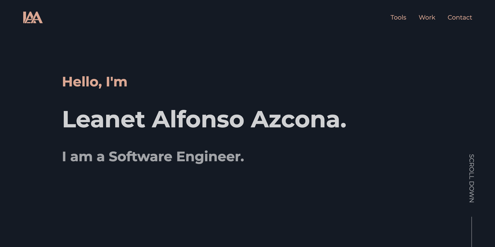

<div align="center">
  
</div>
<h1 align="center">
  leanetalfonso.com
</h1>
<p align="center">
  The first iteration of <a href="https://leanetalfonso.com" target="_blank">leanetalfonso.com</a> built with <a href="https://reactjs.org/ " target="_blank">React</a> and hosted on <a href="https://www.netlify.com/" target="_blank">Netlify</a>
</p>



## Running Locally

Clone the repo

```
git clone https://github.com/LeanetAlfonso/portfolio
```

Change directory

```
cd portfolio
```

Install dependencies

```
npm install
```

Run

```
npm start
```
